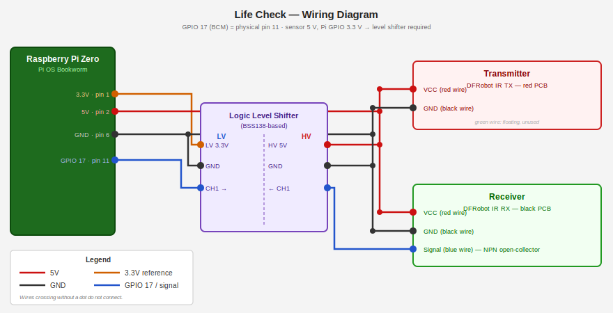

<!-- cspell:ignore raspi dtoverlay cmdline rootwait hotplug iface ifname nmcli pinout -->

# [Life Check](https://github.com/remigius42/life-check)

Copyright 2026 [Andreas Remigius Schmidt](https://github.com/remigius42)

[](LICENSE)

[](https://github.com/remigius42/life-check/actions/workflows/ci.yml)

An unobtrusive life-check system for elderly people — a positive take on the
[dead man's switch](https://en.wikipedia.org/wiki/Dead_man%27s_switch) concept.

A break-beam sensor mounted in a doorway counts daily crossings. A daily webhook
report flags when the count is unusually low, giving family or caregivers a quiet
signal without cameras, wearables, or any required action from the person being
monitored.

Implemented as an Ansible playbook that configures a Raspberry Pi from scratch.

## What it does

- Hardens the Pi: locale, SSH, UFW firewall, fail2ban
- Installs a GPIO polling daemon that counts break-beam events per day
- Sends a daily Slack (or generic webhook) report with a configurable low-count alert
- Exposes a small web UI for live status

## Hardware parts list

| Part                                                                                 | Notes                                                      |
| ------------------------------------------------------------------------------------ | ---------------------------------------------------------- |
| Raspberry Pi (any model with GPIO)                                                   | Tested on Raspberry Pi OS Bookworm                         |
| [DFRobot 5V IR Photoelectric Switch, 4 m](https://www.dfrobot.com/product-2644.html) | Break-beam sensor; separate transmitter and receiver       |
| Logic level shifter, ≥ 1 channel                                                     | Required — receiver signal output is 5 V, Pi GPIO is 3.3 V |
| 5 V power supply for the sensor                                                      | The Pi's 5 V GPIO rail is sufficient; sensor draws 30 mA   |



Wire the receiver blue wire through the logic shifter to **GPIO 17 (BCM), physical pin 11**
(see [pinout.xyz](https://pinout.xyz/pinout/pin11_gpio17/) for the full 40-pin header reference).
The receiver is NPN open-collector — a pull-up to 3.3V is required on the LV side of the shifter.
Most BSS138-based shifter boards include pull-ups on both sides; the daemon also enables the Pi's
internal pull-up (~50 kΩ) as a fallback. Use pin 9 (GND) and pin 2 or 4 (5 V) for sensor power.

## Prerequisites

- Raspberry Pi running Raspberry Pi OS Bookworm (Debian-based)
- Hardware wired as described above
- Ansible 2.14+ on your control machine
- Python 3.13+ with `ansible` and `ansible-lint` (see `pyproject.toml`)
- A Slack incoming webhook URL (or any HTTP endpoint) for daily reports

## Setup

### 1. Clone the repository

```bash
git clone <repo-url> life-check
cd life-check
```

### 2. Create your inventory

```ini
# inventory/hosts
[raspi]
life-check.local ansible_user=pi
```

### 3. Configure variables

Copy or edit `group_vars/all/vars.yml`. The defaults are reasonable; at minimum
set your LAN subnet:

```yaml
ufw_lan_subnet: "192.168.1.0/24"
```

### 4. Create the vault

Secrets (webhook URLs) live in `group_vars/all/vault.yml`, encrypted with
`ansible-vault`. Create a password file first:

```bash
echo 'your-vault-password' > .vault_pass
chmod 600 .vault_pass
```

Fill in your webhook URLs in `group_vars/all/vault.yml`, then encrypt it:

```bash
ansible-vault encrypt group_vars/all/vault.yml
```

`.vault_pass` is already in `.gitignore`. Without it, `ansible-playbook` will
refuse to run because `ansible.cfg` sets `vault_password_file = .vault_pass`.

### 5. Run the playbook

```bash
ansible-playbook playbooks/site.yml
```

### 6. Verify

```bash
ansible-playbook playbooks/verify.yml
```

The verify playbook asserts expected post-state on the target host.

## Raspberry Pi Zero

The Pi Zero has no ethernet port. The recommended approach is USB gadget mode,
which tunnels ethernet over the USB data cable — use the inner port labelled
**USB** (not the power-only port) with a data-capable cable.

**On the SD card (before first boot)**, edit two files in `/boot/firmware/`
(Bookworm moved the boot partition from `/boot/` — older tutorials have the
wrong path):

`/boot/firmware/config.txt` — add at the end:

```text
dtoverlay=dwc2,dr_mode=peripheral
```

`/boot/firmware/cmdline.txt` — insert after `rootwait`, keeping everything on
one line:

```text
... rootwait modules-load=dwc2,g_ether quiet ...
```

**Bookworm networking caveat:** Bookworm uses NetworkManager by default, which
leaves `usb0` unmanaged. The simplest workaround is link-local IPv6 via
`ifupdown`. Create `/etc/network/interfaces.d/usb0` on the Pi:

```text
auto usb0
allow-hotplug usb0
iface usb0 inet6 auto
```

On the host, bring up the interface with link-local and SSH in:

```bash
# Linux
nmcli connection add con-name usb0-ll ifname usb0 type ethernet ipv4.method link-local
ssh pi@fe80::<pi-link-local>%usb0
```

Then point your inventory at the link-local address:

```ini
[raspi]
life-check ansible_user=pi ansible_host=fe80::<pi-link-local>%usb0
```

From there the setup steps are identical to any other Pi.

## Roles

| Role       | Purpose                                                 |
| ---------- | ------------------------------------------------------- |
| `locales`  | Timezone and locale                                     |
| `ssh`      | SSH hardening, optional key management                  |
| `ufw`      | Firewall — allows SSH and the web UI port from LAN only |
| `fail2ban` | Brute-force protection with optional Slack alerts       |
| `detector` | Break-beam daemon, daily reporter, web UI               |

Each role has its own `README.md` with variable reference and example playbook.

## License

MIT — see individual role READMEs for per-role attribution.

[Pico CSS](https://picocss.com) (Copyright 2019-2025) is vendored under the MIT license.
The license notice is preserved in `roles/detector/files/static/pico-*.min.css`.

## Development

See [DEVELOPMENT.md](DEVELOPMENT.md) for local setup, running tests, linting,
and the change workflow.

## Contributing

PRs are welcome. Fair warning: this is a personal project maintained on a
best-effort basis, so responses and reviews may be slow and changes that don't
fit the use case are unlikely to be merged. Opening an issue first to discuss is
the best use of your time.
