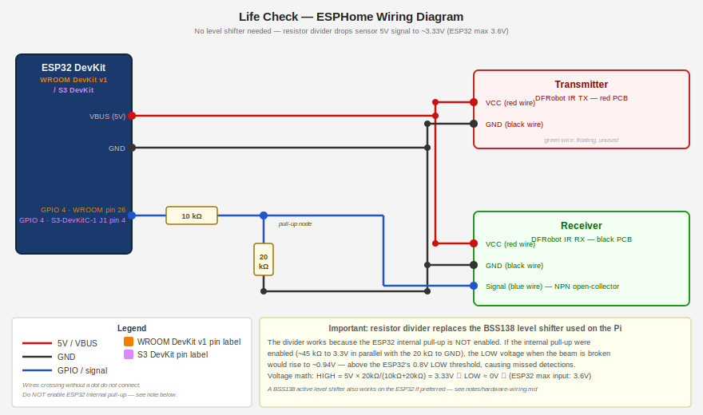
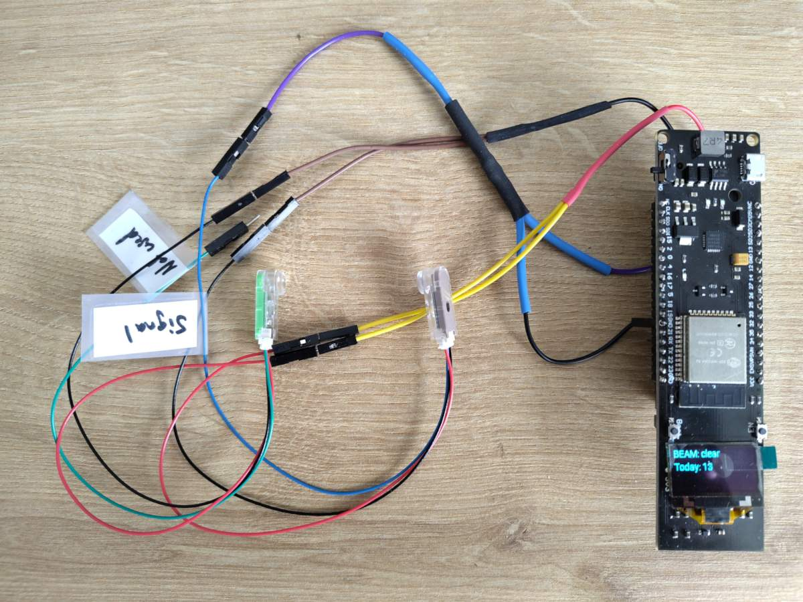

<!-- spellchecker:ignore dialout memaddog newgrp oled pioenvs purecrea ttgo uucp usermod wroom -->

# ESP32 Route

## Parts list

See the **[Full BOM](../hardware/BOM.md)** for assembly materials and tools.

| Part                                                                                 | Notes                                                                 |
| ------------------------------------------------------------------------------------ | --------------------------------------------------------------------- |
| ESP32 dev board (WROOM DevKit v1 or S3 DevKit)                                       | Any ESP32 with a free GPIO works                                      |
| [DFRobot 5V IR Photoelectric Switch, 4 m](https://www.dfrobot.com/product-2644.html) | Same sensor as the Pi route                                           |
| 10 kΩ resistor                                                                       | Series resistor on sensor signal line                                 |
| 20 kΩ resistor                                                                       | Pull-down from GPIO to GND; together with 10 kΩ forms voltage divider |

A passive resistor divider (10 kΩ + 20 kΩ) handles level shifting from the sensor's
5 V signal to the ESP32's 3.3 V GPIO — no separate level shifter board is needed. An active
level shifter (e.g., a BSS138-based module like the "Purecrea 2-channel converter") also works if you prefer it.

## Wiring



Wire sensor power from the board's **VBUS (5 V)** pin. Connect the receiver signal through the
resistor divider (10 kΩ series + 20 kΩ to GND) to the GPIO set in the `substitutions:` block of
`esphome/life-check.yaml` as `beam_gpio_pin`. The default is **GPIO 13**. Do **not** enable the
internal pull-up on the GPIO (the divider acts as the pull-up; enabling the internal pull-up raises
the LOW voltage to ~0.94 V, above the detection threshold).

> **Running on battery?** See the [TTGO battery monitoring](#battery-monitoring) section for the
> voltage divider wiring pattern, ADC sensor config, and the debounce warning that applies to
> any battery-powered ESP32. The relevant config lives in `esphome/packages/ttgo.yaml`.

### TTGO all-in-one board

The TTGO (WROOM + 18650 + OLED) hard-wires GPIO 4 and 5 to the onboard OLED
display (SCL=4, SDA=5). Use **GPIO 13** (or any other free pin) for the sensor
and update `beam_gpio_pin` in the `substitutions:` block of `esphome/life-check.yaml` accordingly.

To enable the OLED display (shows beam state and today's break count), uncomment the
`packages:` entry near the top of `esphome/life-check.yaml`:

```yaml
packages:
  ttgo: !include packages/ttgo.yaml
```

To also enable battery monitoring (requires voltage divider wiring — see below), open
`esphome/packages/ttgo.yaml` and additionally uncomment the `sensor:` and `text_sensor:`
battery blocks, and the battery line in the display lambda.

> **Note:** ESPHome will warn that GPIO5 is a strapping pin (it controls VDDSDIO
> voltage selection at boot). This is expected and safe on the TTGO board: GPIO5
> must be HIGH at boot, and the I2C pull-up resistors keep it HIGH. No boot
> failures result from this wiring.

#### Battery monitoring

The TTGO board has no built-in battery monitoring circuit. To enable the
"Battery Voltage" and "Battery Level" sensors, wire a voltage divider from the
battery+ through-hole pad on the board underside:

1. Solder a wire to the **battery+ pad** (large pad on the underside where the 18650 holder is soldered)
1. Connect: battery+ → 100 kΩ → **GPIO34** header pin
1. Connect: junction between the two resistors → 100 kΩ → **GND** header pin

The firmware reads the midpoint voltage and multiplies by 2.0 to recover the
actual battery voltage. GPIO34 is input-only and ADC1 (safe with WiFi active).

> **Warning:** Do not reduce `beam_debounce` below 250 ms when running on battery. WiFi TX bursts
> draw 200–300 mA and cause brief supply voltage sag that can pull the sensor signal line below
> the ESP32 HIGH threshold, producing false beam-break counts. The 250 ms debounce rejects these
> transients.



## 3D Printed Housing

To protect the ESP32 from dust and accidental shorts, a 3D-printed enclosure is recommended. We
recommend the **[ESP32 WROOM Case](https://makerworld.com/en/models/1891997)** by
**[MeMaddog](https://makerworld.com/en/@memaddog)** on MakerWorld.

This specific model is a perfect fit for the 30-pin DevKit v1 used in this project. We have chosen
to link directly to the author's page rather than vendoring the file to ensure the creator
receives proper credit and traffic for their work. See [hardware/3d/README.md](../hardware/3d/README.md)
for our full hardware philosophy.

## Prerequisites

- Python 3.13+ with a virtual environment

- A webhook URL for daily reports — see [notifications.md](notifications.md) for
  Slack setup and alternatives

- Serial port access — your user must be in the group that owns `/dev/ttyUSB0` (or
  `/dev/ttyACM0`). Check with `stat -c "%G" /dev/ttyUSB0`:

  - **Debian/Ubuntu**: group is `dialout` → `sudo usermod -a -G dialout $USER`
  - **Arch/EndeavourOS**: group is `uucp` → `sudo usermod -a -G uucp $USER`

  Then activate immediately with `newgrp uucp` (or `newgrp dialout`), or log out and back in.

## Setup

### 1. Clone the repository and install dependencies

```bash
git clone https://github.com/remigius42/life-check
cd life-check
python3 -m venv .venv
source .venv/bin/activate
pip install -r requirements-dev.txt
```

### 2. Create your secrets file and review compile-time config

Configuration is split across two files:

- **`esphome/secrets.yaml`** — credentials only: WiFi SSID/password, OTA password,
  web UI credentials, and webhook URL. These must be set before flashing.
- **`substitutions:` block in `esphome/life-check.yaml`** — non-secret compile-time
  config: `beam_gpio_pin` (default GPIO 13) and `timezone` (default `Europe/Zurich`).
  These two values are compile-time only and cannot be changed via the web UI after
  flashing: `beam_gpio_pin` is physically wired at assembly, and `timezone` uses an
  opaque POSIX string format (e.g., `CET-1CEST,M3.5.0,M10.5.0/3`) that is error-prone
  to edit at runtime.

Everything else — threshold, retry count, message templates, and report time — has
sensible defaults and can be configured via the web UI after first flash without
reflashing.

```bash
cp esphome/secrets.yaml.example esphome/secrets.yaml
# Edit esphome/secrets.yaml with your WiFi credentials and webhook URL
# Open esphome/life-check.yaml and update beam_gpio_pin / timezone if needed
```

`secrets.yaml` is gitignored — never commit it.

### 3. First flash (USB)

Connect the ESP32 via USB, then:

```bash
esphome run esphome/life-check.yaml
```

ESPHome will compile the firmware, flash it over USB, and open the serial log.
After first flash the device is on your WiFi and subsequent updates can be done
over-the-air.

### 4. OTA updates

Once the device is on the network you have two options:

**CLI (recommended for development):**

```bash
esphome run esphome/life-check.yaml
```

ESPHome discovers the device via mDNS and uploads wirelessly — no USB required.

**Browser upload:**

```bash
esphome compile esphome/life-check.yaml
```

Then open the device web UI → OTA section and upload the `.bin` from
`.esphome/build/life-check/.pioenvs/life-check/firmware.bin`. Useful for
handing off a firmware file without CLI access.

### 5. Configure webhook and thresholds

Open the device's web UI at its IP address on port 80. All runtime settings
(webhook URL, message templates, threshold, retry count, report time) are editable
there and survive reboots.

Message templates support a `{count}` placeholder that is replaced with today's
numeric crossing count before sending. For example:
`"Beam breaks today: {count} — looking good!"` → `"Beam breaks today: 5 — looking good!"`

The default templates omit the count intentionally — including exact numbers in a
shared channel could reveal more about someone's daily routine than intended.

The web UI also includes:

- **Test Mode**: A switch to temporarily pause counting.
- **Reset Today's Count**: A button to immediately clear the current daily crossing count.
- **Report Hour / Report Minute**: Set the local time for the daily webhook report (default 17:00).
