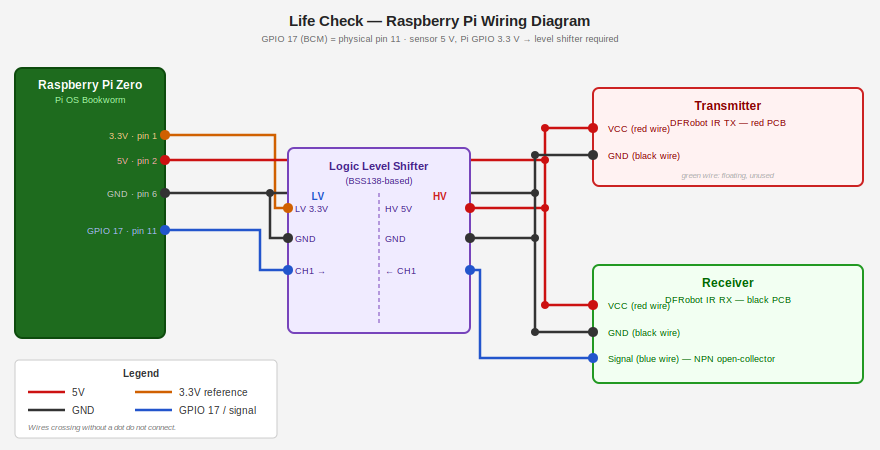

<!-- spellchecker:ignore armhf avahi cmdline conv customisation firstboot firstrun -->

<!-- spellchecker:ignore imager pinout purecrea raspi raspios rootwait romakev -->

# Raspberry Pi Route

## Parts list

See the **[Full BOM](../hardware/BOM.md)** for assembly materials and tools.

| Part                                                                                 | Notes                                                                                                                            |
| ------------------------------------------------------------------------------------ | -------------------------------------------------------------------------------------------------------------------------------- |
| Raspberry Pi (any model with GPIO)                                                   | Raspberry Pi OS Bookworm or later                                                                                                |
| [DFRobot 5V IR Photoelectric Switch, 4 m](https://www.dfrobot.com/product-2644.html) | Break-beam sensor; separate transmitter and receiver                                                                             |
| Logic level shifter, ≥ 1 channel                                                     | Required (e.g., a BSS138-based module like the "Purecrea 2-channel converter") — receiver signal output is 5 V, Pi GPIO is 3.3 V |
| 5 V power supply for the sensor                                                      | The Pi's 5 V GPIO rail is sufficient; sensor draws 30 mA                                                                         |

## Wiring



Wire the receiver blue wire through the logic shifter to **GPIO 17 (BCM), physical pin 11**
(see [pinout.xyz](https://pinout.xyz/pinout/pin11_gpio17/) for the full 40-pin header reference).
The receiver is NPN open-collector — a pull-up to 3.3V is required on the LV side of the shifter.
Most BSS138-based shifter boards include pull-ups on both sides; the daemon also enables the Pi's
internal pull-up (~50 kΩ) as a fallback. Use pin 9 (GND) and pin 2 or 4 (5 V) for sensor power.

## 3D Printed Housing

A parametric housing for the logic level shifter is available in
[`hardware/3d/level-shifter-case.scad`](../hardware/3d/level-shifter-case.scad).
The model is a configured version of the [Parametric Project
Box](https://makerworld.com/en/models/46852) by
[Matthew](https://makerworld.com/en/@Matthew) on MakerWorld.

It is an [OpenSCAD](https://openscad.org/) file, allowing you to customize the
dimensions and wall thickness if you use a different board. The vendored version
is pre-configured with internal dimensions (30x13.5x30mm) suitable for a
standard 4-channel BSS138 module and its Dupont connectors.

For the Raspberry Pi Zero itself, we recommend the **[Slim Snap-Fit
Case](https://makerworld.com/en/models/548199)** by
**[Romakev](https://makerworld.com/en/@Romakev)** on MakerWorld.

See [hardware/3d/README.md](../hardware/3d/README.md) for our full hardware
philosophy.

## Prerequisites

- Raspberry Pi running Raspberry Pi OS Bookworm or later — download
  [Raspberry Pi OS Lite](https://www.raspberrypi.com/software/operating-systems/);
  Pi 1 / Pi Zero / Pi Zero W require the **32-bit** image (ARMv6); all others
  support both, 64-bit recommended
- Hardware wired as described above
- Ansible 2.14+ on your control machine
- Python 3.13+ with `ansible` and `ansible-lint` (see `pyproject.toml`)
- A webhook URL for daily reports — see [notifications.md](notifications.md) for
  Slack setup and alternatives

## Models without ethernet (Pi Zero W, Pi Zero 2W, etc.)

> **Applies to:** Pi Zero W, Pi Zero 2W, and any other Pi with WiFi but no
> ethernet. For the Pi Zero (original, no WiFi), use USB gadget mode instead —
> the Ansible steps are identical once you have SSH access.

### Option A — [Raspberry Pi Imager](https://www.raspberrypi.com/software/) (recommended)

Open **OS Customisation** (Ctrl+Shift+X) before flashing and fill in hostname,
username/password, WiFi SSID/password, and enable SSH. Imager writes a
`firstrun.sh` to the FAT32 `/boot/firmware/` partition automatically. Works
from any OS.

### Option B — Manual (`dd` + `firstrun.sh`)

Flash the image with `dd` (replace `/dev/sdX` with your SD card device — check
`lsblk` first):

```bash
dd if=2025-05-13-raspios-bookworm-armhf-lite.img of=/dev/sdX bs=4M status=progress conv=fsync
```

Then add two things to the FAT32 `/boot/firmware/` partition (readable and
writable from any OS — no ext4 mounting required):

**`/boot/firmware/firstrun.sh`** — copy [`scripts/firstrun.sh`](../scripts/firstrun.sh)
from the repository and edit the variables at the top before placing it on the SD card.

**`/boot/firmware/cmdline.txt`** — append the following parameters to the
existing single line (order is irrelevant; the file must remain one line;
avoid duplicates):

```text
... rootwait systemd.run=/boot/firmware/firstrun.sh systemd.run_success_action=reboot systemd.run_failure_action=none systemd.unit=kernel-command-line.target quiet ...
```

On first boot the script runs as root, configures WiFi and SSH, then removes
itself and the `systemd.run` entries from `cmdline.txt`. If something goes
wrong, `/var/log/firstrun.log` persists on the root partition — mount the SD
card on your host and read it to see exactly which command failed.

> **`custom.toml`:** Bookworm also has experimental support for a `custom.toml`
> file on `/boot/firmware/` as an alternative to `firstrun.sh` — see
> [`firstboot`](https://github.com/RPi-Distro/raspberrypi-sys-mods/blob/432b34383c36db52df90f879b2d0b92177d9b2a3/usr/lib/raspberrypi-sys-mods/firstboot)
> and
> [`init_config`](https://github.com/RPi-Distro/raspberrypi-sys-mods/blob/432b34383c36db52df90f879b2d0b92177d9b2a3/usr/lib/raspberrypi-sys-mods/init_config)
> in `raspberrypi-sys-mods`. It is explicitly unsupported and will be removed
> when cloud-init lands.

## Setup

Before continuing, verify SSH works: `ssh <PI_USER>@<HOSTNAME>.local`
(mDNS via avahi — replace with IP if mDNS is unavailable on your network).

### 1. Clone the repository (on your control machine)

```bash
git clone https://github.com/remigius42/life-check
cd life-check
```

### 2. Create your inventory

Copy `inventory/hosts.example` to `inventory/hosts` and edit the hostname and
username to match your `firstrun.sh` / Imager settings.

### 3. Configure variables

Copy or edit `group_vars/all/vars.yml`. The defaults are reasonable; at minimum
set your LAN subnet:

```yaml
ufw_lan_subnet: "192.168.1.0/24"
```

### 4. Create the vault

Secrets (webhook URLs) live in `group_vars/all/vault.yml`, encrypted with
`ansible-vault`. Create a password file first:

```bash
echo 'your-vault-password' > .vault_pass
chmod 600 .vault_pass
```

The repo ships with an encrypted vault — replace it with your own (this opens
`$EDITOR`; fill in your webhook URLs and save):

```bash
rm group_vars/all/vault.yml
ansible-vault create group_vars/all/vault.yml
```

The vault must contain:

```yaml
vault_fail2ban_slack_webhook_url: "https://hooks.slack.com/..."
vault_detector_report_webhook_url: "https://hooks.slack.com/..."
```

Omit any variables you don't need.

`.vault_pass` is already in `.gitignore`. Without it, `ansible-playbook` will
refuse to run because `ansible.cfg` sets `vault_password_file = .vault_pass`.

### 5. Run the playbook

```bash
ansible-playbook playbooks/site.yml --ask-pass
```

### 6. Verify

```bash
ansible-playbook playbooks/verify.yml --ask-pass
```

The verify playbook asserts expected post-state on the target host.

## Using the Web UI

Access the "Life Check" dashboard at `http://<hostname>.local:8080/` (or your
configured port).

- **Current Status**: Shows real-time beam state and today's total crossings.
- **Test Mode**: Click "Enable test mode" to perform maintenance without
  counting crossings. It auto-reverts after 30 minutes (configurable).
- **Manual Reset**: Click "Reset Today's Count" to immediately clear any
  accidental triggers.
- **History**: The dashboard displays a table of daily totals for the last 14
  days.

## Ansible roles

| Role                                      | Purpose                                                 |
| ----------------------------------------- | ------------------------------------------------------- |
| [`locales`](../roles/locales/README.md)   | Timezone and locale                                     |
| [`ssh`](../roles/ssh/README.md)           | SSH hardening, optional key management                  |
| [`ufw`](../roles/ufw/README.md)           | Firewall — allows SSH and the web UI port from LAN only |
| [`fail2ban`](../roles/fail2ban/README.md) | Brute-force protection with optional Slack alerts       |
| [`detector`](../roles/detector/README.md) | Break-beam daemon, daily reporter, web UI               |

Each role has its own `README.md` with variable reference and example playbook.
